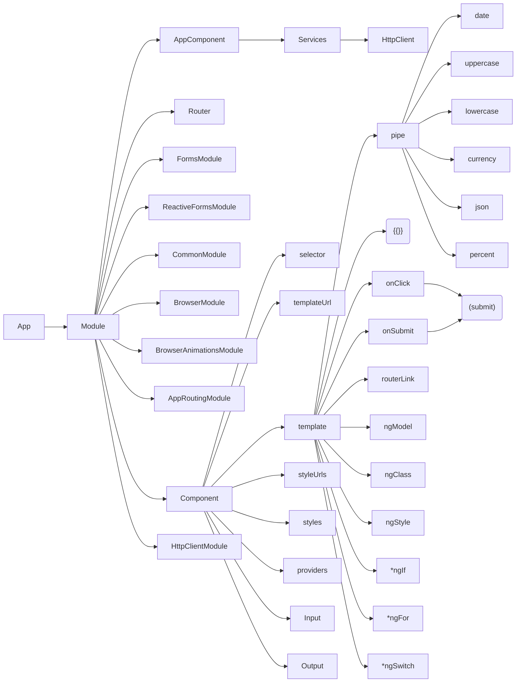

# Angular commands
ng generate component product-details
ng generate service cart
npm install
npm serve

ng build
ng build --prod

#

```mermaid
graph LR
App --> Module --> Component

Module --> Router
Module --> FormsModule
Module --> ReactiveFormsModule
Module --> CommonModule
Module --> BrowserModule
Module --> BrowserAnimationsModule
Module --> AppRoutingModule
Module --> AppComponent
Module --> HttpClientModule

AppComponent --> Services
Services --> HttpClient 

Component --> selector
Component --> templateUrl
Component --> template
Component --> styleUrls
Component --> styles
Component --> providers
Component --> Input
Component --> Output

template --> pipe
template --> Variable("{{}}")
template --> onClick --> click("(click)")
template --> onSubmit --> click("(submit)")
template --> routerLink
template --> ngModel
template --> ngClass
template --> ngStyle

template --> *ngIf
template --> *ngFor 
template --> *ngSwitch

pipe --> date
pipe --> uppercase
pipe --> lowercase
pipe --> currency
pipe --> json
pipe --> percent

```
